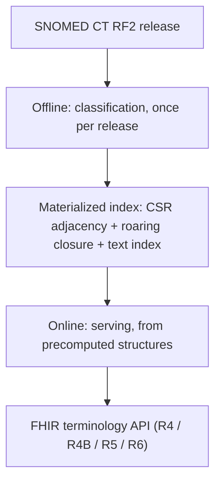

# Architecture at a glance

This page is a short tour of the design. The full design authority, with
citations to the terminology-server and graph-reachability literature, is
[`docs/architecture.md`](https://github.com/rubentalstra/notio/blob/main/docs/architecture.md)
in the repository.

<!-- toc -->

## SNOMED CT is two things at once

SNOMED CT is a formal ontology in the OWL 2 EL profile, and it is a
polyhierarchical graph. The is-a hierarchy a client queries is the inferred
hierarchy, produced by a description-logic reasoner, not the stated one.

That fact splits the system into two problems that have different engineering
answers:

- **Offline: classification, once per release.** The hierarchy Notio serves is a
  reasoner output. Notio computes the transitive closure from the shipped
  inferred relationship file once per release and persists it. It never
  re-derives inference at query time.
- **Online: serving, from precomputed structures.** Each operation is answered
  from the structure shaped for it: a subsumption test is a bitmap membership
  test, an ECL descendant set is a bitmap returned directly, and a point read is
  a lookup in a columnar store.

## Index-materialized graph, not a graph database

SNOMED is stored as a graph, natively: integer-keyed compressed sparse-row (CSR)
adjacency arrays, plus roaring bitmaps holding the transitive closure. This is a
graph *model* with an index-materialized *store*.

A general-purpose graph database is rejected on the evidence. No production
terminology server uses one: Ontoserver is Postgres plus Lucene, Snowstorm is
Elasticsearch, and Hermes is a memory-mapped store plus Lucene. Graph databases
degrade on the deep multi-hop neighborhoods that ECL descendant expansion
produces, which is exactly the query a terminology server is stressed by. At
SNOMED's size the full transitive closure fits in memory and gives an O(1)
subsumption test with no traversal fallback.

## Persistence is a pure-Rust embedded engine

The built structures persist in `redb`, a pure-Rust, memory-mapped, ACID
embedded key-value engine. The build tool writes these artifacts once per
edition, and the server opens them read-only. `redb` is the storage format. At
startup the server loads the transitive closure into a resident, ordinal-indexed
structure so a subsumption test is a membership check against a resident bitmap,
which is how the design reaches microsecond-scale subsumption in pure Rust.

## FHIR support is machine-generated

HL7 publishes the whole type system and every operation as machine-readable
`StructureDefinition` and `OperationDefinition` resources, in versioned packages.
Notio vendors and pins those packages and generates per-version Rust modules from
them, so R5's extra `$expand` parameters appear where the spec has them and are
absent where it does not. Every generated file is marked `// @generated`, a drift
check regenerates it in CI, and one runtime wrapper answers R4, R4B, R5, and R6
callers at once. This mirrors how the sibling project FerroEHR generates its
openEHR model.

## The SNOMED semantics are hand-written

RF2 loading, the materialized ontology, ECL evaluation, and `$expand` paging are
the product, and no existing Rust project provides them. ECL is the hard part:
every expression constraint returns a set of codes, so the evaluator compiles ECL
to set algebra over the descendant bitmaps and the attribute adjacency, using
bitmap AND and OR rather than pointer-chasing. Correctness is measured against
Snowstorm as the reference server.

## Text search is a separate index

Description search is its own concern, held in its own index. A word inverted
index maps each word to a roaring-bitmap postings list, and an `fst` dictionary
answers per-word prefix and fuzzy lookup. A query intersects the matching words'
postings, applies the language-reference-set and active-status filters, and sorts
by matched-term length.
