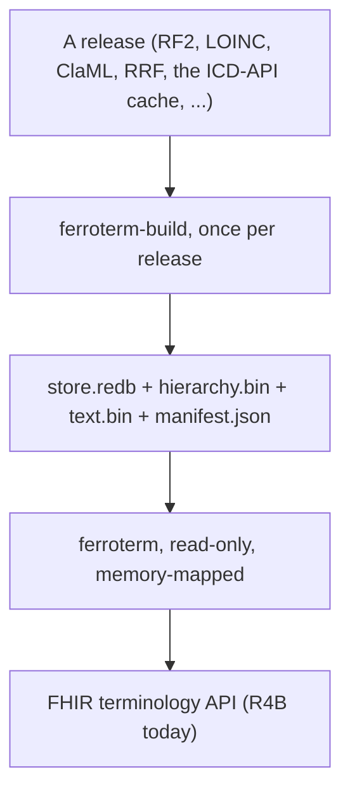

# Architecture at a glance

This page is a short tour of the design as built. The full design authority,
with citations to the terminology-server and graph-reachability literature, is
[`docs/architecture.md`](https://github.com/rubentalstra/FerroTERM/blob/main/docs/architecture.md)
in the repository.

<!-- toc -->

## Offline once, online from precomputed structures

A code system release is turned into served structures once, by
`ferroterm-build`, and the server opens them read-only:

For SNOMED CT the hierarchy a client queries is the inferred one, a reasoner
output SNOMED ships in its inferred relationship file; the build computes its
transitive closure once and persists it. The server never re-derives
inference and never parses a release at request time.

## An index-materialized graph, not a graph database

The hierarchy is stored as integer-keyed compressed sparse-row (CSR)
adjacency plus roaring bitmaps holding the transitive closure in both
directions. A subsumption test is a bitmap membership test, a descendant set is
a bitmap returned directly, and set operations over value sets are bitmap AND,
OR, and difference. Typed relationships (RxNorm's `has_ingredient`, for one)
are a second adjacency with the type on each edge, both directions
materialized.

A general-purpose graph database is rejected on the evidence: no production
terminology server uses one (Ontoserver is Postgres plus Lucene, Snowstorm is
Elasticsearch, Hermes a memory-mapped store plus Lucene), and graph databases
degrade on exactly the deep multi-hop neighbourhoods a descendant expansion
produces.

## The artifact layout

Every code system builds into the same four files, so the server opens each
by its manifest and nothing downstream knows which file format it came from:

| File | Holds |
|---|---|
| `store.redb` | concepts, designations with language and use, typed properties, the vocabularies; a pure-Rust, memory-mapped, ACID embedded engine |
| `hierarchy.bin` | the CSR is-a adjacency and the roaring closure bitmaps |
| `text.bin` | the `fst` word dictionary and roaring postings of every designation, by language |
| `manifest.json` | the system, version, languages, counts, and the files above |

Some systems add a file: RxNorm's typed edges (`relations.bin`) and atom
identifiers (`atoms.bin`), ICD-11's entity keys (`keys.bin`) and
postcoordination scales (`scales.json`). No FHIR or SNOMED specification
governs this layout; it is the project's own design.

## The provider seam

The operations talk to a `CodeSystemProvider` trait and nothing else: locate a
code, its display and designations by language, its status and properties, the
hierarchy when the system has one, search, enumeration, filters, implicit value
sets, and subsumption. Each code system implements the seam over its artifact
(or, for the registry systems, over a grammar and a vendored table), and
declares its capabilities, filters, and properties for
`TerminologyCapabilities`. The compose layer (include, exclude, filters,
paging, `total`) sits once above every provider.

## FHIR support is machine-generated

HL7 publishes the whole type system and every operation as machine-readable
`StructureDefinition` and `OperationDefinition` resources, in versioned
packages. FerroTERM vendors and pins those packages (R4 4.0.1, R4B 4.3.0, R5
5.0.0, R6 ballot 5, HL7 Terminology) and generates per-version Rust modules
from them, so a parameter R5 adds appears in the R5 module and is absent from
R4B. Every generated file is marked `// @generated`, and a drift check
regenerates it in CI. The server mounts the R4B module today; the R4, R5, and
R6 modules exist and are the v0.0.9 milestone.

## Text search is a separate index

Description search is its own concern. A word index maps each folded word to a
roaring postings list of designations, with an `fst` dictionary for prefix
lookup, per language. A `filter` on `$expand` intersects the matching words'
postings and the value set's members.
