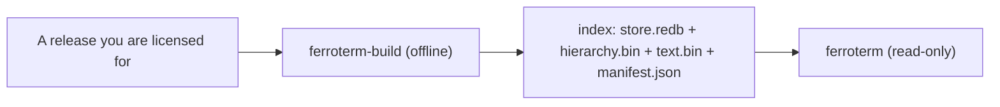

# Loading code systems

FerroTERM serves the code systems you load. Each arrives as the release its
owner distributes, turned once into an index by `ferroterm-build`, and served
read-only. This page covers the licensing rule, the build step, and the
command for every supported source; the sections below name each system.

<!-- toc -->

## You bring your own content

> [!WARNING]
> This repository ships no code system content, and no build of FerroTERM
> contains any. SNOMED CT is licensed by SNOMED International, LOINC by
> Regenstrief, ICD by the WHO, RxNorm by the NLM. You must hold whatever
> licence the release you load requires.

The split is firm: the software in this repository is open source under the
MIT license, and the code system content is the property of its owner and is
not distributed here. A SNOMED CT licence is free within member countries, the
Netherlands among them, and available under the affiliate licence elsewhere;
LOINC needs a free account; ICD-10-CM and the RxNorm prescribable subset are
public downloads; ICD-11 comes through the WHO's own container under its
licence.

## The offline build

The running server never parses a release. `ferroterm-build` turns it into the
memory-mapped index once, and the server opens the index read-only. The tool
ships in every release tarball beside `ferroterm` and in the container image.



Every source builds into the same layout, and the manifest names the system,
so `FERROTERM_INDEX` takes any mix of them. When a new release arrives, rebuild
its index and restart the server against it.

## Loading a SNOMED CT edition

The command takes the release zip as SNOMED International or your national
release centre distributes it, or the unpacked release directory, and writes
the index:

```console
$ ferroterm-build --rf2 /path/to/SnomedCT_Release.zip --out /path/to/ferroterm-index
```

From a zip, only the `Snapshot/` tree is unpacked, to a temporary directory
that is removed when the build ends; the Full and Delta trees are never read.
With the container image the same build is one compose command (see
[Install and run](install.md)). The build reads the concepts, descriptions,
language reference sets, and inferred relationships, computes the transitive
closure, and writes the store, the hierarchy, and the text index. The Dutch
edition of June 2026 takes 49 s and 591 MB.

The edition and version come from the release itself (the module and
effective time), and `$lookup` returns them as the version URI
(`http://snomed.info/sct/11000146104/version/20260630`).

## Loading LOINC

The same tool builds a LOINC release into the same artifact layout. Download
the release from <https://loinc.org/downloads/> (a free account; the licence
allows use and redistribution with the LOINC copyright notice, and the
repository ships no release) and build it:

```console
$ ferroterm-build --loinc /path/to/Loinc_2.82.zip --out /path/to/loinc-index
```

The zip's term table, parts, hierarchy, answer lists, and linguistic variants
are unpacked to a temporary directory; the part-link tables are not read. The
version is taken from the release name (`Loinc_2.82`), else pass
`--loinc-version`. Point `FERROTERM_INDEX` at the directory beside your SNOMED
CT index; the server opens each by the system its manifest names.

## Loading ICD-10 and ICD-10-CM

The same tool builds the ICD-10 family. A ClaML document (WHO ICD-10 from
your WHO licence, the Dutch translation from the WHO-FIC Collaborating Centre
at RIVM, or any other ClaML classification) is served under the system URI
you name:

```console
$ ferroterm-build --claml /path/to/icd10nl-2021.xml \
    --system http://hl7.org/fhir/sid/icd-10-nl --out /path/to/icd10nl-index
```

The version comes from the document's `Title`; pass `--claml-version` when
the title has none. A zip is accepted; its largest `.xml` entry is the
document.

ICD-10-CM is a free download from CMS
(<https://www.cms.gov/medicare/coding-billing/icd-10-codes>): the "Code
Descriptions in Tabular Order" zip holds the order file and the "Code Tables,
Tabular and Index" zip holds the tabular XML. Give both:

```console
$ ferroterm-build --icd10cm 2026-code-descriptions-tabular-order.zip \
    --icd10cm 2026-code-tables-tabular-and-index.zip --out /path/to/icd10cm-index
```

Codes come out with the period (`A00.0`, `S02.0XXA`); chapters are named by
their range (`A00-B99`); the order file's header flag is the `valid`
property. Point `FERROTERM_INDEX` at each directory as for LOINC.

## Loading RxNorm

The "Current Prescribable Content" subset needs no licence
(<https://www.nlm.nih.gov/research/umls/rxnorm/docs/prescribe.html>); the
full monthly release needs a UMLS licence. Both have the same shape:

```console
$ ferroterm-build --rxnorm RxNorm_full_prescribe_09082026.zip --out /path/to/rxnorm-index
```

The version is the release date from the readme inside the zip (`09082026`);
pass `--rxnorm-version` when the release has none. The build keeps the names
of the unrestricted sources (`RXNORM`, `MTHSPL`). A full release carries
sources the UMLS licence restricts by category; name the ones your licence
covers with `--rxnorm-sources MSH,VANDF` to serve their names too. Point
`FERROTERM_INDEX` at the directory as for LOINC.

## Loading ICD-11

ICD-11 comes from the WHO ICD-API. Run the local deployment WHO publishes
(<https://icd.who.int/icdapi>; the licence, CC BY-ND 3.0 IGO, allows the
local copy but not passing it on), then let the build walk it into a cache
and build the three code systems:

```console
$ docker run -d -p 8080:80 -e acceptLicense=true -e saveAnalytics=false \
    -e include=2026-01_en whoicd/icd-api
$ ferroterm-build --icd11 /path/to/icd11-cache --icd11-api http://127.0.0.1:8080 \
    --icd11-release 2026-01 --icd11-languages en --out /path/to/icd11-index
```

The cache holds one JSON file per entity and language (about 110,000 files
for the MMS, the ICF, and the Foundation) and is reused by later builds, so
the API is only needed once per release. The build writes
`icd11-index/mms`, `icd11-index/icf`, and `icd11-index/entity`; point
`FERROTERM_INDEX` at each of the three. Languages beyond English need the
deployment to include them (`include=2026-01_fr`); the build records every
language the cache holds.

## Test content

FerroTERM's own tests use shaped, synthetic content only. They never contain real
content extracted from a release, which keeps the licence line clean in the
repository itself.
