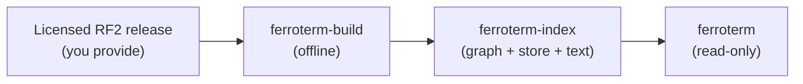

# Loading a SNOMED CT edition

FerroTERM serves the SNOMED CT edition you load. This page explains the licensing
rules you must satisfy first, and the planned build step that turns an RF2 release
into the index the server reads.

<!-- toc -->

## You bring your own content

> [!WARNING]
> This repository ships no SNOMED CT content, and no build of FerroTERM contains any.
> SNOMED CT is licensed separately by SNOMED International. You must hold a valid
> SNOMED CT licence for the edition you load.

The split is firm, and you must keep the two apart:

- **The software** in this repository is open source under the MIT license.
- **SNOMED CT content** is the property of SNOMED International and is not
  distributed here.

A SNOMED CT licence is free within member countries, the Netherlands among them,
and available under the affiliate licence elsewhere. You obtain the RF2 release
for your edition from your national release centre or from SNOMED International,
under your licence, and you load it into FerroTERM yourself.

## The offline build

The running server never parses RF2 and never classifies the ontology. A separate
tool, `ferroterm-build`, turns an RF2 release into the memory-mapped index once
per edition, and the server opens that index read-only. The tool ships in every
release tarball beside `ferroterm` and in the container image.



The command takes the release zip as SNOMED International or your national
release centre distributes it, or the unpacked release directory, and writes
the index:

```console
$ ferroterm-build --rf2 /path/to/SnomedCT_Release.zip --out /path/to/ferroterm-index
```

From a zip, only the `Snapshot/` tree is unpacked, to a temporary directory
that is removed when the build ends; the Full and Delta trees are never read.
With the container image the same build is one compose command (see
[Install and run](install.md)).

The build computes the transitive closure from the shipped inferred relationship
file, builds the CSR adjacency and the roaring closure bitmaps, writes the
columnar concept and description store, and builds the text index. It runs once
per release. When a new edition arrives, you rebuild the index and restart the
server against it.


## Test content

FerroTERM's own tests use shaped, synthetic content only. They never contain real
SNOMED CT concepts extracted from a release, which keeps the licence line clean
in the repository itself.

## Loading LOINC

The same tool builds a LOINC release into the same artifact layout. Download
the release from <https://loinc.org/downloads/> (a free account; the licence
allows use and redistribution with the LOINC copyright notice, and the
repository ships no release) and build it:

```console
$ ferroterm-build --loinc /path/to/Loinc_2.82.zip --out /path/to/loinc-index
```

The zip's term table, parts, hierarchy, answer lists, and linguistic variants
are unpacked to a temporary directory; the part-link tables are not read. The
version is taken from the release name (`Loinc_2.82`), else pass
`--loinc-version`. Point `FERROTERM_INDEX` at the directory beside your SNOMED
CT index; the server opens each by the system its manifest names.

## Loading ICD-10 and ICD-10-CM

The same tool builds the ICD-10 family. A ClaML document (WHO ICD-10 from
your WHO licence, the Dutch translation from the WHO-FIC Collaborating Centre
at RIVM, or any other ClaML classification) is served under the system URI
you name:

```console
$ ferroterm-build --claml /path/to/icd10nl-2021.xml \
    --system http://hl7.org/fhir/sid/icd-10-nl --out /path/to/icd10nl-index
```

The version comes from the document's `Title`; pass `--claml-version` when
the title has none. A zip is accepted; its largest `.xml` entry is the
document.

ICD-10-CM is a free download from CMS
(<https://www.cms.gov/medicare/coding-billing/icd-10-codes>): the "Code
Descriptions in Tabular Order" zip holds the order file and the "Code Tables,
Tabular and Index" zip holds the tabular XML. Give both:

```console
$ ferroterm-build --icd10cm 2026-code-descriptions-tabular-order.zip \
    --icd10cm 2026-code-tables-tabular-and-index.zip --out /path/to/icd10cm-index
```

Codes come out with the period (`A00.0`, `S02.0XXA`); chapters are named by
their range (`A00-B99`); the order file's header flag is the `valid`
property. Point `FERROTERM_INDEX` at each directory as for LOINC.

## Loading RxNorm

The "Current Prescribable Content" subset needs no licence
(<https://www.nlm.nih.gov/research/umls/rxnorm/docs/prescribe.html>); the
full monthly release needs a UMLS licence. Both have the same shape:

```console
$ ferroterm-build --rxnorm RxNorm_full_prescribe_09082026.zip --out /path/to/rxnorm-index
```

The version is the release date from the readme inside the zip (`09082026`);
pass `--rxnorm-version` when the release has none. The build keeps the names
of the unrestricted sources (`RXNORM`, `MTHSPL`). A full release carries
sources the UMLS licence restricts by category; name the ones your licence
covers with `--rxnorm-sources MSH,VANDF` to serve their names too. Point
`FERROTERM_INDEX` at the directory as for LOINC.

## Loading ICD-11

ICD-11 comes from the WHO ICD-API. Run the local deployment WHO publishes
(<https://icd.who.int/icdapi>; the licence, CC BY-ND 3.0 IGO, allows the
local copy but not passing it on), then let the build walk it into a cache
and build the three code systems:

```console
$ docker run -d -p 8080:80 -e acceptLicense=true -e saveAnalytics=false \
    -e include=2026-01_en whoicd/icd-api
$ ferroterm-build --icd11 /path/to/icd11-cache --icd11-api http://127.0.0.1:8080 \
    --icd11-release 2026-01 --icd11-languages en --out /path/to/icd11-index
```

The cache holds one JSON file per entity and language (about 110,000 files
for the MMS, the ICF, and the Foundation) and is reused by later builds, so
the API is only needed once per release. The build writes
`icd11-index/mms`, `icd11-index/icf`, and `icd11-index/entity`; point
`FERROTERM_INDEX` at each of the three. Languages beyond English need the
deployment to include them (`include=2026-01_fr`); the build records every
language the cache holds.
