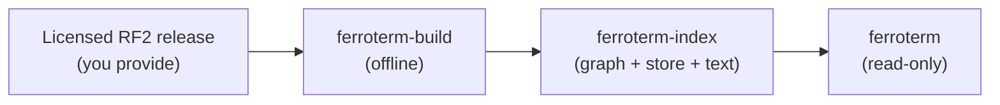

# Loading a SNOMED CT edition

FerroTERM serves the SNOMED CT edition you load. This page explains the licensing
rules you must satisfy first, and the planned build step that turns an RF2 release
into the index the server reads.

<!-- toc -->

## You bring your own content

> [!WARNING]
> This repository ships no SNOMED CT content, and no build of FerroTERM contains any.
> SNOMED CT is licensed separately by SNOMED International. You must hold a valid
> SNOMED CT licence for the edition you load.

The split is firm, and you must keep the two apart:

- **The software** in this repository is open source under the MIT license.
- **SNOMED CT content** is the property of SNOMED International and is not
  distributed here.

A SNOMED CT licence is free within member countries, the Netherlands among them,
and available under the affiliate licence elsewhere. You obtain the RF2 release
for your edition from your national release centre or from SNOMED International,
under your licence, and you load it into FerroTERM yourself.

## The offline build (planned)

The running server never parses RF2 and never classifies the ontology. A separate
tool turns an RF2 release into the memory-mapped index once per edition, and the
server opens that index read-only.



The planned command takes the unpacked RF2 release and writes the index:

```console
$ ferroterm-build --rf2 /path/to/SnomedCT_Release --out /path/to/ferroterm-index
```

The build computes the transitive closure from the shipped inferred relationship
file, builds the CSR adjacency and the roaring closure bitmaps, writes the
columnar concept and description store, and builds the text index. It runs once
per release. When a new edition arrives, you rebuild the index and restart the
server against it.

> [!NOTE]
> The build tool is in design. The command name and flags above are the intended
> shape.

## Test content

FerroTERM's own tests use shaped, synthetic content only. They never contain real
SNOMED CT concepts extracted from a release, which keeps the licence line clean
in the repository itself.
