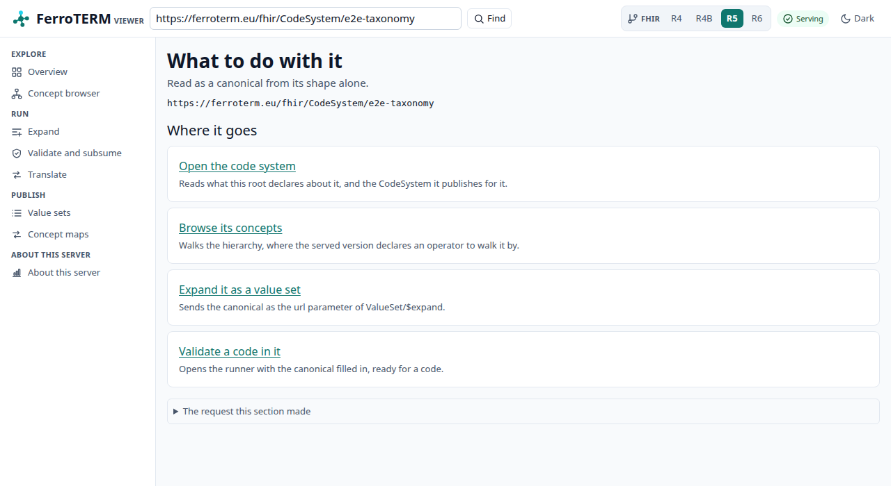
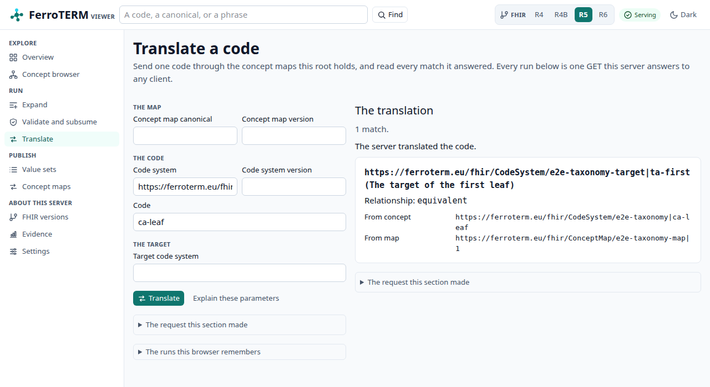
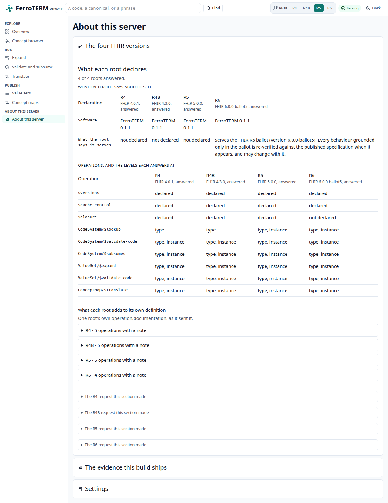

# The viewer

A deployment answers the FHIR terminology API, and until you write a request by
hand it tells you nothing about what it loaded. The viewer closes that gap. It
is a browser interface the server hands out at `/ui`, built from the same
binary and the same image, and it reads the deployment through the public API
like any other client. Editing is a second bundle at `/ui/editor`, so a reader
who never edits downloads none of it.

<!-- toc -->

## Reaching it

Start the server and open `/ui`. The root path redirects there, so
`http://localhost:8080/` lands on the overview.

```console
$ docker run --rm -p 8080:8080 ghcr.io/rubentalstra/ferroterm:0.1.5
$ open http://localhost:8080/ui
```

`FERROTERM_UI` turns it off ([Configuration](configuration.md)). With
`FERROTERM_UI=off` the `/ui` routes are gone, and `/` and `/ui` answer the
`not-found` `OperationOutcome` that every unknown path answers, which is what
an API-only deployment wants. A build that carries no viewer bundle serves no
`/ui` route whatever the variable says, and prints that at start.

The viewer talks to the origin it was served from and to no other. There is no
parameter that points it at a different server.

## The boundary

**The browser is the FHIR client.** Every screen below is built from responses
to requests the server answers to anyone. The viewer declares no endpoint of
its own, holds no credential, and asks the server for nothing a client cannot
ask for. Each section of each screen carries a disclosure that reveals the
exact request it made, as a URL you can copy and run with `curl`. Check the
claim on any screen; you do not have to take it from this page.

The viewer only reads. The server exposes create, update, and delete on
`CodeSystem`, `ValueSet`, and `ConceptMap`; no screen calls them.

## The packaging

One binary, one image. The bundle is compiled to WebAssembly and embedded in
the `ferroterm` binary at build time, so a release tarball and the container
image behave the same way and there is no directory to mount or misplace.

Nothing is rendered on the server. The document the server sends is empty until
the WebAssembly bundle loads and draws the page, which has three consequences
worth knowing before you deploy it: the first paint waits for that bundle,
JavaScript has to be enabled, and a search engine sees nothing. The API is the
answer for anything that needs those, and it is the whole product.

## The screens

Every screen keeps its state in the address. A filter you typed, the page you
are on, and the FHIR version you selected are all query parameters, so a link
you copy reproduces what you were looking at, and the back button walks your
reading. You reach the screens from the sidebar on the left. The version
switcher in the top bar moves the page you are on to another root: `/r4`,
`/r4b`, `/r5`, or `/r6`, so it changes what every screen reads rather than
taking you to a screen of its own. On a narrow window the sidebar is folded
away behind the "Screens" button in the top bar.

The screenshots below come from a server loaded with one small synthetic code
system, so every code and display in them is invented. Your own deployment
shows the editions you built.

### The command bar

Above every screen. Type a code, a canonical, or a phrase, and the viewer reads
it by its shape alone, before any request. What it offers is gated on the one
request the screen makes: the root's own `CapabilityStatement`, so an operation
this root does not declare is never offered. Every offer is an address you
could have typed, so what you found is a link you can send.



### Overview

What this deployment serves, rendered from
`GET /{version}/metadata?mode=terminology`. One table, one row per served
version, with the version an unversioned request resolves to, the content mode,
whether the root subsumes over it, and the artifact it was read from. Order it
by any of the three system-level columns; the order lives in the address.


### One code system

Two documents describe a code system, and this screen shows both. The upper
pane is what the capability statement says this server can do with it. The
lower pane is the published `CodeSystem` resource, which describes the code
system itself. Every affordance on the other screens is gated on the upper
pane: where a version declares no hierarchy filter, no tree is offered.


### Concept browser

Search a code system, read one concept, and walk what the server declares of
its hierarchy. The search is `ValueSet/$expand` with a `filter`, the concept is
`CodeSystem/$lookup`, and each level of the tree is one `$expand` over the
child filter the version declares. The tree follows the ARIA tree view pattern:
one tab stop, arrow keys to open and close a node, `Enter` to read the concept
under the cursor, and every move is a navigation, so a walk is a link.


### Expansion runner

`ValueSet/$expand` by canonical, with `filter`, `count`, `offset`,
`displayLanguage`, `activeOnly`, and `includeDesignations`. The answer shows
the total, the parameters the server says it applied, and page controls that
walk the rest.


### Validate and subsume

Two runners on one screen, because both answer a question about codes rather
than about a set. `$validate-code` takes a code and either the code system or
the value set to judge it against; the root's capability statement decides
which levels the form offers, and where a root declares the instance level a
stored resource's id stands in for the canonical. The answer states the
verdict, the message the server gave, the display it holds, and whether the
concept is inactive. `$subsumes` takes two codes in one system and states the
relation the server found between them. Running either puts its parameters in
the address, so a case is shareable by link.


### Value sets

The `ValueSet` resources this root publishes, searched by `url` and `version`.
Opening one shows what its definition selects and links into the expansion
runner. A value set a code system defines implicitly is not published as a
resource, so it is absent here; the runner takes its canonical directly.


### Concept maps

The `ConceptMap` resources this root publishes, searched by `url` and
`version`. Opening one shows the groups it maps and links into the translate
runner with the map already named.


### Translate

`ConceptMap/$translate`, over the maps this root holds. Name a code and the
system it belongs to; leave the map empty and the server picks the maps it
holds for that code. The answer lists each match with the equivalence the
server stated and the map it came from.



### About this server

One screen at `/ui/about`, in three panes, for the questions that are not about
a code. Each pane opens with the line it is there to say and keeps its detail
one press away. The addresses the three used to have still work: `/ui/versions`,
`/ui/evidence` and `/ui/settings` open the pane they named.

**The four FHIR versions.** The four served roots side by side, each read from
its own `GET /{version}/metadata`. One table compares what each root declares of
the terminology operations, the other what it declares of the resources. The
pane exists because the versions genuinely differ: R4 and R4B declare `$lookup`
at the type level and R5 added the instance level, and the viewer offers on each
screen only what the root you are on declares.

**The evidence this build ships.** The conformance and benchmark figures the
repository commits. This is the one pane that asks the server nothing: its
figures were read out of committed files when the bundle was built, so they
describe the FerroTERM build your deployment is running rather than the
deployment itself, and it says so and names the release version. Three
summaries, each naming the file every one of its numbers came from:

- The HL7 terminology ecosystem suite, one row per mode and served root, with
  the cases passed of the cases run. The counts come from the pass lists under
  `conformance/tx-ecosystem/`, and the build stops when a list and the table in
  that directory's README disagree.
- The latency bars from `bench/bars.json`, each with the run recorded against
  it and the room that run had. A bar is the claim and never moves to match a
  slower run.
- The newest committed benchmark run under `bench/records/`, one record per
  code system, with the machine it was taken on, the FerroTERM version that
  answered it, and the cold, median, and percentile timings per operation.

No number here is typed into the viewer's source. Each one is read from its
committed file at build time, so you can open that file in the repository and
check it.

**Settings.** The FHIR base in use, the theme, the density, the default FHIR
version, a display language, and the page size. These live in the browser that
shows them. The server is neither asked nor told about any of them, so nothing
here changes what another reader sees.



### Editing a concept map

Sign in, and `/ui/editor/conceptmap` authors a local `ConceptMap`: its
canonical, version and status, the value sets that scope it, and one group per
pair of systems with the codes it maps between them. Both sides of every
mapping are picked by searching the system the group names, so a code arrives
with the display your server gave it.

The screen writes the elements the FHIR version you are on defines. On `/r4`
and `/r4b` that is `source[x]`, `target[x]` and `equivalence`; on `/r5` and
`/r6` it is `sourceScope[x]`, `targetScope[x]`, `relationship` and `noMap`. The
relationship control offers whatever your server expands that version's own
value set to, so nothing about the codes is compiled into the viewer.

**Preview before you save.** Each code carries a control that runs
`ConceptMap/$translate` with the map on screen sent inline, so you see what the
mapping does before anything is written. A server that does not accept a map
sent that way makes the preview fall back to the saved map, and the panel says
so.

Saving sends the whole resource with `If-Match`. If someone changed the map
since you opened it, the server answers `412`, the screen says so in its own
words and offers to reload. A map your deployment loaded from a file opens the
same screen read-only, because the REST API is not managing it.

## Signing in

The viewer is read-only until you configure an identity provider. Set
`FERROTERM_OIDC_ISSUER` and `FERROTERM_VIEWER_CLIENT_ID`
([Configuration](configuration.md)), and the top bar gains a **Sign in**
control. Without both, the control does not exist and neither does any edit
control.

Signing in happens at `/ui/editor`, which is where the editing screens are. On
`/ui` the control is a link there: a token lives in the page that holds it, and
a page load ends it, so signing in on one page and editing on another would
sign you out on the way.

The viewer is a public client: it holds no secret and signs in with the
authorization code flow with PKCE against the issuer your server publishes in
`[base]/.well-known/smart-configuration`
(<https://hl7.org/fhir/smart-app-launch/app-launch.html>). Register the
redirect address `https://your-server/ui/editor/callback` with the identity
provider,
under the client id you set in `FERROTERM_VIEWER_CLIENT_ID`, and allow the
scopes `openid`, `fhirUser`, `user/CodeSystem.cud`, `user/ValueSet.cud`, and
`user/ConceptMap.cud`. A role that gets none of the three `user/` scopes reads
the server and changes nothing.

The access token stays in the browser tab's memory. It is never written to
`localStorage` and never put in a cookie, so closing the tab signs out. Signing
out drops the token and, where your issuer publishes a `revocation_endpoint`,
revokes it there (RFC 7009).

## Composing a value set

Signed in with `user/ValueSet.cud`, the editor bundle's **Compose a value set**
screen builds a local `ValueSet.compose` and saves it through the same REST API
any client uses.

A definition is a set of clauses. Every include adds to the selection and the
value set is the union of them all; the criteria inside one include are taken
together, so a code has to satisfy all of them; an exclude takes codes back out
of that union (<https://hl7.org/fhir/R4B/valueset.html#compositions>). The
screen says which of those each clause is doing, in a sentence under it, and
names the invariant a clause breaks by its own number: `vsd-1` for a clause
that selects nothing, `vsd-2` for codes or filters with no code system, `vsd-3`
for codes and filters at once.

A clause draws in a value set your server already publishes, picked from the
list, or any canonical you type, including a form a code system defines for
itself. It selects out of a code system with the filter properties and
operators that system's served version declares, which the screen reads from
`TerminologyCapabilities`: a system declaring an expression-constraint filter
offers it here, a system declaring none offers none, and a clause pinned to a
code system version is offered that version's filters. A filter value the
server refuses is shown with the character its diagnostic points at marked.

Own codes are picked out of the clause's code system through a search, so a
clause cannot name a code the system does not hold, and each one can carry the
display this value set gives it.

**Run the preview** expands the definition on screen, saved or not: it posts it
to `ValueSet/$expand` in the `valueSet` parameter and pages the answer
(<https://hl7.org/fhir/R4B/valueset-operation-expand.html>). The page and the
text filter are in the address, so a preview is a link you can send.

**Save** sends the resource with `If-Match`, so a value set someone else
changed since you opened it is refused with 412 and the screen offers to reload
it (<https://hl7.org/fhir/R4B/http.html#concurrency>). An update replaces the
whole resource, so the save carries back every element the form does not draw,
from the description to a code's own designations
(<https://hl7.org/fhir/R4B/http.html#update>). Every refusal is shown in the
server's own words. Content your server serves from its loaded indexes has no
write path, so it opens here to read and offers no save under any role.

## History and restoring a version

Every editing screen carries a **History of this resource** link once the
server holds the resource, which opens `/ui/editor/history` on it. The screen
lists the versions the server holds, newest first, with when each was written,
the interaction that wrote it where the answer states one, and `meta.source`
where your server states one. `meta.source` is a source system rather than a
person: FHIR keeps who changed a resource in `Provenance` and `AuditEvent`, so
the column is headed **Source system** and is usually empty.

How the list is read depends on what your server declares in its
`CapabilityStatement`. A server declaring `history-instance` answers the whole
list at once. FerroTERM declares `vread`, so the viewer reads each earlier
version back one request at a time, counting down from the version the resource
states, and the screen says so. Only the most recent versions are listed.

**Compare two versions** picks an earlier and a later one and lists the
elements they disagree about: the path, whether it was added, removed or
changed, and both values. It compares the two documents structurally rather
than as text, so what you read is which elements moved.
`meta.versionId` and `meta.lastUpdated` are left out, because your server
assigns both on every write and they differ between any two versions. The two
versions are in the address, so a comparison is a link you can send.

**Restore this version** writes that version's whole resource back as a new
version. It states `If-Match` of the version the server holds now, not the one
being restored, so a change someone else made since you opened the screen is
refused with 412 and the screen offers to reload. The restore control appears
only for an account whose token carries the write scope for the resource type;
everyone else reads the same versions and restores nothing.

### Seeing what a release changed

Where the [synchronisation service](sync.md) is running and its admin listener
is reachable at the same address the viewer is served from, the screen also
lists what the newest run found about the resource you have open: the codes it
names that the activated release made inactive, removed, or pushed outside the
value set they came through. The listener authenticates nobody, so publish it
nowhere else; a reverse proxy that maps `/runs` on your server's origin to the
sync service's listener is what makes these findings visible, and without one
the screen does not show the section.

## About these screenshots

Each image is a capture of a running server, taken by a browser driven through
WebDriver, over the synthetic fixture in `e2e/fixtures/codesystems`. The
repository distributes no SNOMED CT content and no derived edition data, and a
picture of real concepts would be exactly that, so no licensed release is ever
the subject of one.

They are refreshed by the browser battery, which captures them only when asked:

```console
$ scripts/ui-e2e.sh --docs-shots
```

That builds the bundle, builds the image the release lane builds, runs it
beside a pinned Chromium, drives the journeys, and then writes one PNG per
screen into `website/book/src/operate/img/viewer`. Without `--docs-shots` the
battery changes no file in the checkout, which is why an ordinary run on a pull
request never rewrites an image here.
