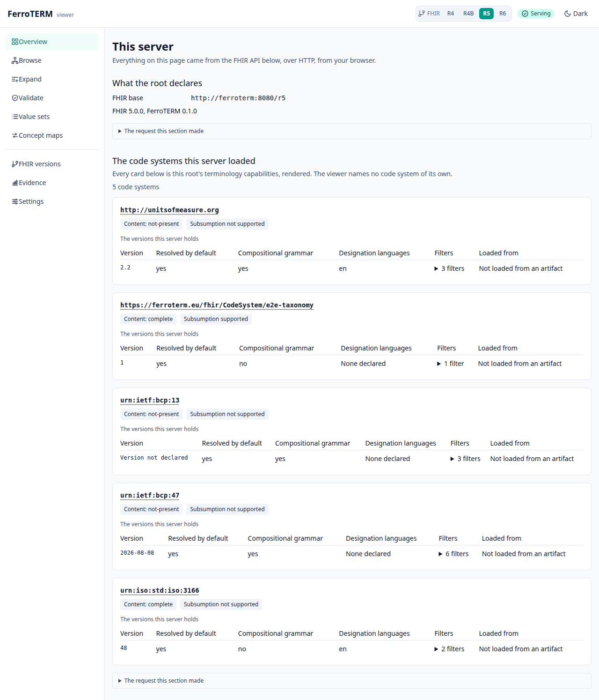
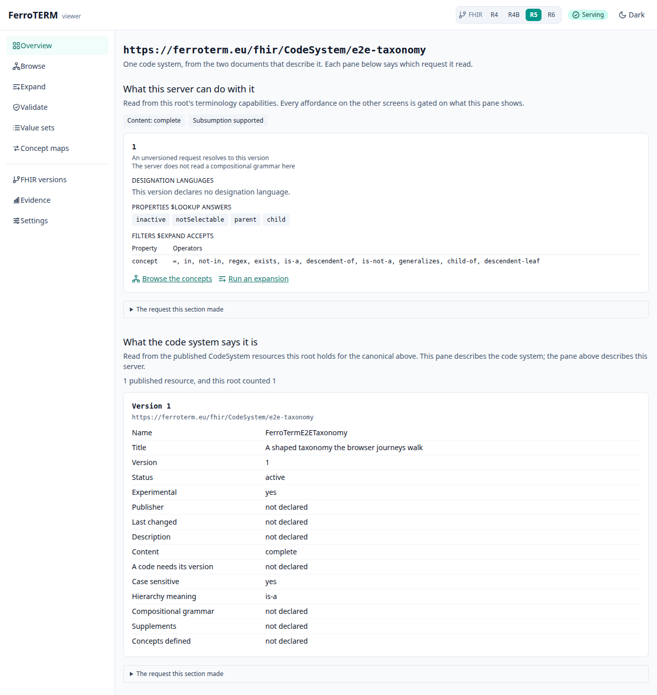
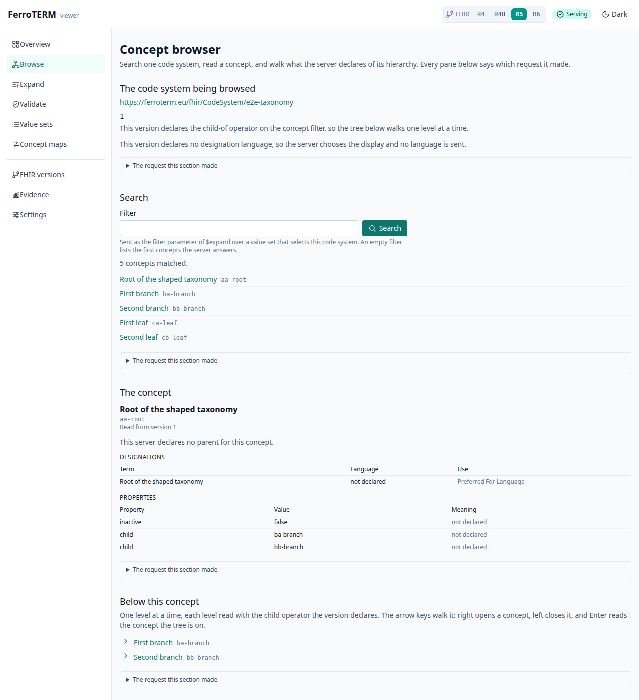
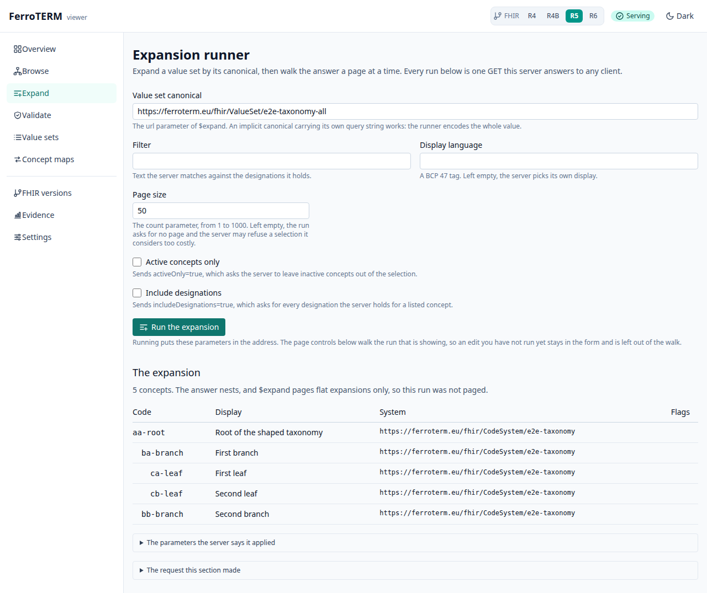
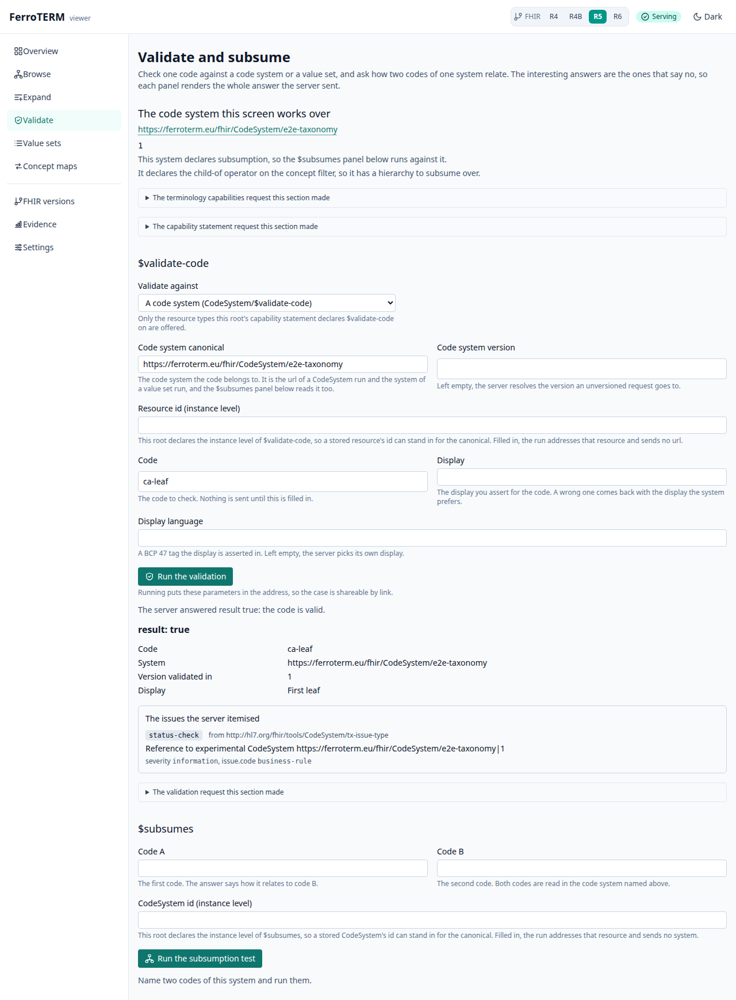
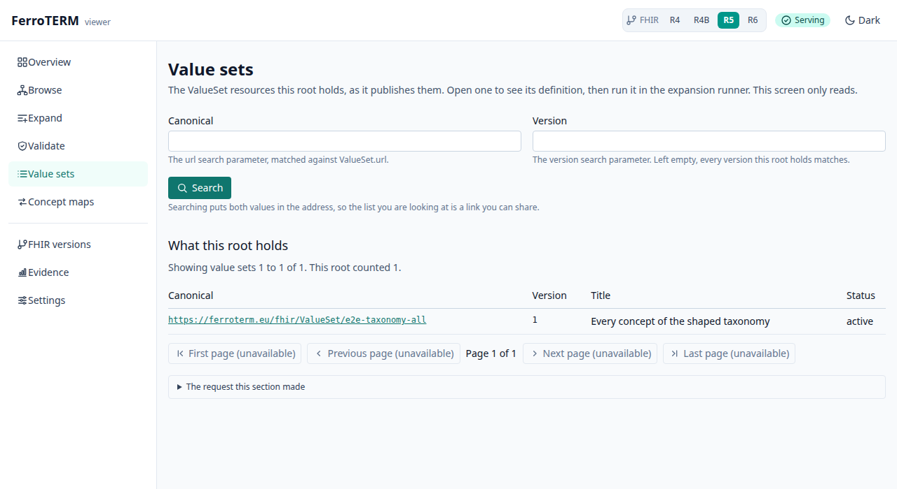
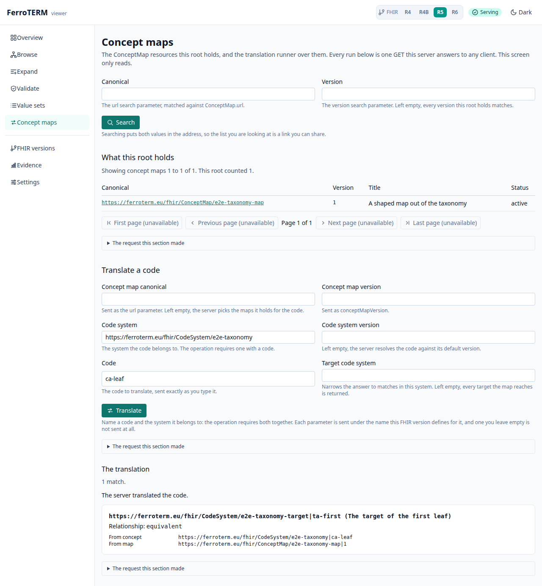
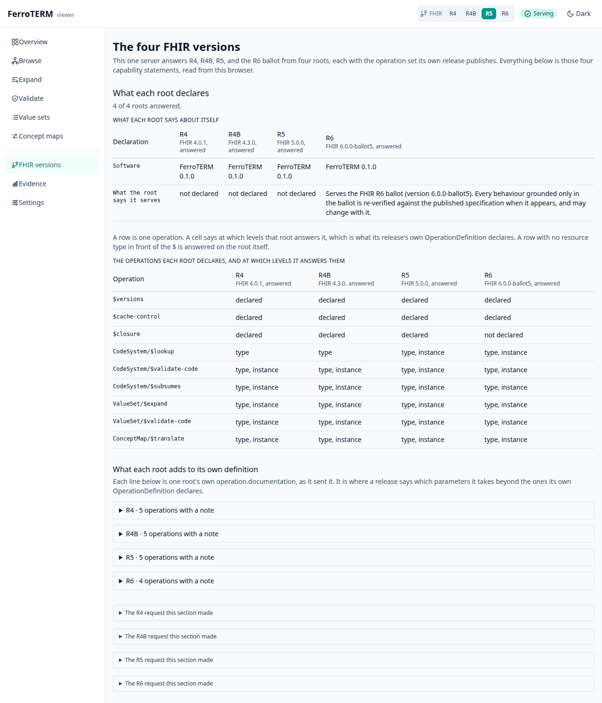
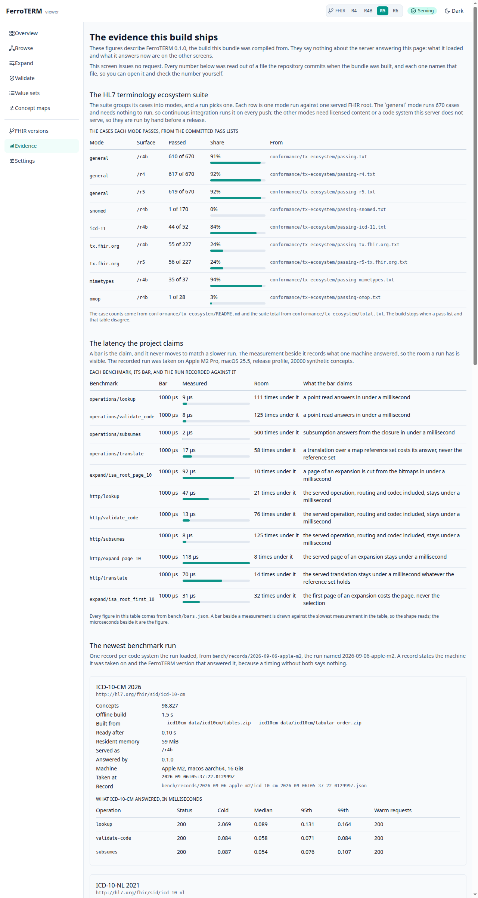
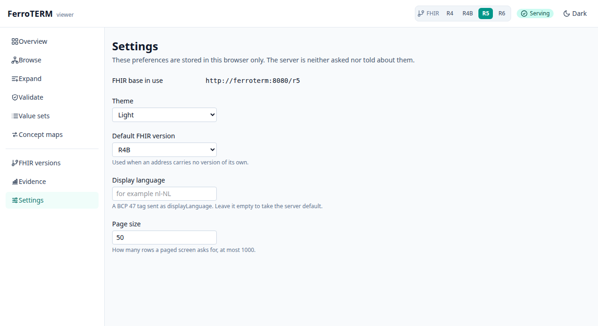

# The viewer

A deployment answers the FHIR terminology API, and until you write a request by
hand it tells you nothing about what it loaded. The viewer closes that gap. It
is a browser interface the server hands out at `/ui`, built from the same
binary and the same image, and it reads the deployment through the public API
like any other client.

<!-- toc -->

## Reaching it

Start the server and open `/ui`. The root path redirects there, so
`http://localhost:8080/` lands on the overview.

```console
$ docker run --rm -p 8080:8080 ghcr.io/rubentalstra/ferroterm:0.1.0
$ open http://localhost:8080/ui
```

`FERROTERM_UI` turns it off ([Configuration](configuration.md)). With
`FERROTERM_UI=off` the `/ui` routes are gone, and `/` and `/ui` answer the
`not-found` `OperationOutcome` that every unknown path answers, which is what
an API-only deployment wants. A build that carries no viewer bundle serves no
`/ui` route whatever the variable says, and prints that at start.

The viewer talks to the origin it was served from and to no other. There is no
parameter that points it at a different server.

## The boundary

**The browser is the FHIR client.** Every screen below is built from responses
to requests the server answers to anyone. The viewer declares no endpoint of
its own, holds no credential, and asks the server for nothing a client cannot
ask for. Each section of each screen carries a disclosure that reveals the
exact request it made, as a URL you can copy and run with `curl`. Check the
claim on any screen; you do not have to take it from this page.

The viewer only reads. The server exposes create, update, and delete on
`CodeSystem`, `ValueSet`, and `ConceptMap`; no screen calls them.

## The packaging

One binary, one image. The bundle is compiled to WebAssembly and embedded in
the `ferroterm` binary at build time, so a release tarball and the container
image behave the same way and there is no directory to mount or misplace.

Nothing is rendered on the server. The document the server sends is empty until
the WebAssembly bundle loads and draws the page, which has three consequences
worth knowing before you deploy it: the first paint waits for that bundle,
JavaScript has to be enabled, and a search engine sees nothing. The API is the
answer for anything that needs those, and it is the whole product.

## The screens

Every screen keeps its state in the address. A filter you typed, the page you
are on, and the FHIR version you selected are all query parameters, so a link
you copy reproduces what you were looking at, and the back button walks your
reading. You reach the screens from the sidebar on the left. The version
switcher in the top bar moves the page you are on to another root: `/r4`,
`/r4b`, `/r5`, or `/r6`, so it changes what every screen reads rather than
taking you to a screen of its own. On a narrow window the sidebar is folded
away behind the "Screens" button in the top bar.

The screenshots below come from a server loaded with one small synthetic code
system, so every code and display in them is invented. Your own deployment
shows the editions you built.

### Overview

What this deployment serves, rendered from
`GET /{version}/metadata?mode=terminology`. One card per code system, with the
versions it holds, which one an unversioned request resolves to, the
designation languages it declares, the filters `$expand` accepts, and the
artifact the system was built from.



### One code system

Two documents describe a code system, and this screen shows both. The upper
pane is what the capability statement says this server can do with it. The
lower pane is the published `CodeSystem` resource, which describes the code
system itself. Every affordance on the other screens is gated on the upper
pane: where a version declares no hierarchy filter, no tree is offered.



### Concept browser

Search a code system, read one concept, and walk what the server declares of
its hierarchy. The search is `ValueSet/$expand` with a `filter`, the concept is
`CodeSystem/$lookup`, and each level of the tree is one `$expand` over the
child filter the version declares. The tree follows the ARIA tree view pattern:
one tab stop, arrow keys to open and close a node, `Enter` to read the concept
under the cursor, and every move is a navigation, so a walk is a link.



### Expansion runner

`ValueSet/$expand` by canonical, with `filter`, `count`, `offset`,
`displayLanguage`, `activeOnly`, and `includeDesignations`. The answer shows
the total, the parameters the server says it applied, and page controls that
walk the rest.



### Validate and subsume

Two runners on one screen, because both answer a question about codes rather
than about a set. `$validate-code` takes a code and either the code system or
the value set to judge it against; the root's capability statement decides
which levels the form offers, and where a root declares the instance level a
stored resource's id stands in for the canonical. The answer states the
verdict, the message the server gave, the display it holds, and whether the
concept is inactive. `$subsumes` takes two codes in one system and states the
relation the server found between them. Running either puts its parameters in
the address, so a case is shareable by link.



### Value sets

The `ValueSet` resources this root publishes, searched by `url` and `version`.
Opening one shows what its definition selects and links into the expansion
runner. A value set a code system defines implicitly is not published as a
resource, so it is absent here; the runner takes its canonical directly.



### Concept maps

The `ConceptMap` resources this root publishes, and `ConceptMap/$translate`
over them. Name a code and the system it belongs to; leave the map empty and
the server picks the maps it holds for that code. The answer lists each match
with the equivalence the server stated and the map it came from.



### FHIR versions

The four served roots side by side, each read from its own
`GET /{version}/metadata`. One table compares what each root declares of the
terminology operations, the other what it declares of the resources. The screen
exists because the versions genuinely differ: R4 and R4B declare `$lookup` at
the type level and R5 added the instance level, and the viewer offers on each
screen only what the root you are on declares.



### Evidence

The conformance and benchmark figures the repository commits, at `/ui/evidence`.
This is the one screen that asks the server nothing. Its figures were read out
of committed files when the bundle was built, so they describe the FerroTERM
build your deployment is running rather than the deployment itself, and the
screen says so at the top and names the release version.

Three sections, each naming the file every one of its numbers came from:

- The HL7 terminology ecosystem suite, one row per mode and served root, with
  the cases passed of the cases run. The counts come from the pass lists under
  `conformance/tx-ecosystem/`, and the build stops when a list and the table in
  that directory's README disagree.
- The latency bars from `bench/bars.json`, each with the run recorded against
  it and the room that run had. A bar is the claim and never moves to match a
  slower run.
- The newest committed benchmark run under `bench/records/`, one record per
  code system, with the machine it was taken on, the FerroTERM version that
  answered it, and the cold, median, and percentile timings per operation.

No number here is typed into the viewer's source. Each one is read from its
committed file at build time, so you can open that file in the repository and
check it.



### Settings

The FHIR base in use, the theme, the default FHIR version, a display language,
and the page size. These live in the browser that shows them. The server is
neither asked nor told about any of them, so nothing here changes what another
reader sees.



## About these screenshots

Each image is a capture of a running server, taken by a browser driven through
WebDriver, over the synthetic fixture in `e2e/fixtures/codesystems`. The
repository distributes no SNOMED CT content and no derived edition data, and a
picture of real concepts would be exactly that, so no licensed release is ever
the subject of one.

They are refreshed by the browser battery, which captures them only when asked:

```console
$ scripts/ui-e2e.sh --docs-shots
```

That builds the bundle, builds the image the release lane builds, runs it
beside a pinned Chromium, drives the journeys, and then writes one PNG per
screen into `website/book/src/operate/img/viewer`. Without `--docs-shots` the
battery changes no file in the checkout, which is why an ordinary run on a pull
request never rewrites an image here.
